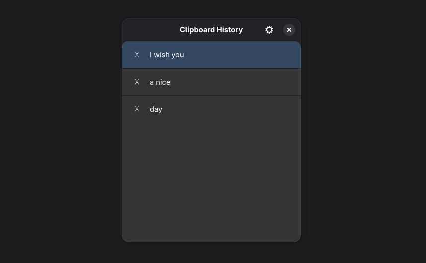

# Pasty 📋

A modern, simple, and lightweight clipboard manager written in Python, GTK4, and Libadwaita.
Designed to integrate perfectly with the GNOME desktop environment on Linux.



## ✨ Features

* **Native Design:** Polished interface that follows GNOME Human Interface Guidelines (Libadwaita).
* **Persistent History:** Keeps your clipboard history safe even after a restart.
* **Smart:** Automatically ignores duplicates and identical consecutive copies.
* **Global Shortcut:** Integrates seamlessly with system custom shortcuts.
* **Configurable:** You decide how many items to keep in memory.

## 🛠️ Requirements

* Python 3.10+
* GTK4 and Libadwaita
* Fedora Workstation (Recommended) or other Linux distros with GNOME

## 🚀 Installation (Fedora)

1.  **Clone the repository:**
    ```bash
    git clone [https://github.com/Negatorto/pasty.git](https://github.com/Negatorto/pasty.git)
    cd pasty
    ```

2.  **Install system dependencies:**
    ```bash
    sudo dnf install python3-gobject gtk4 libadwaita python3-pip
    ```

3.  **Create a virtual environment and install Python packages:**
    ```bash
    python3 -m venv venv
    source venv/bin/activate
    pip install -r src/requirements.txt
    ```

## 🔄 Autostart (Run in Background)

To have Pasty start automatically at login and monitor your clipboard in the background, you can create an autostart entry. 
Using the `--silent` flag ensures the app starts working without opening the main window.

1.  **Create the autostart directory if it doesn't exist:**
    ```bash
    mkdir -p ~/.config/autostart
    ```

2.  **Create the desktop file:**
    ```bash
    nano ~/.config/autostart/pasty.desktop
    ```

3.  **Paste the following content** (make sure to replace `/absolute/path/to/pasty/` with your actual path):
    ```ini
    [Desktop Entry]
    Type=Application
    Name=Pasty Background
    Comment=Clipboard Manager
    Exec=/absolute/path/to/pasty/pasty.sh --silent
    Icon=edit-paste
    Hidden=false
    NoDisplay=false
    X-GNOME-Autostart-enabled=true
    ```

## ⌨️ Shortcut Configuration

To open Pasty with a keyboard shortcut (e.g., `Super + V`) and view your history:

1.  Go to **Settings** > **Keyboard** > **View and Customize Shortcuts**.
2.  Click on **Custom Shortcuts**.
3.  Add a new shortcut running the `pasty.sh` script (without the `--silent` flag):
    * **Name:** Pasty
    * **Command:** `/absolute/path/to/pasty/pasty.sh`
    * **Shortcut:** Choose your preferred combination (e.g., `Super+V`).

Make sure `pasty.sh` has execution permissions:
```bash
chmod +x pasty.sh
```

## 📄 License

This project is licensed under the **GNU General Public License v3.0** - see the [LICENSE](LICENSE) file for details.
